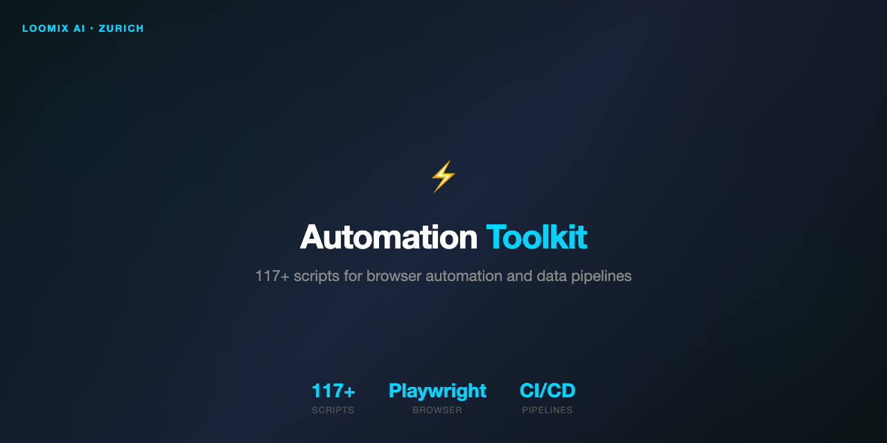

<h1 align="center">Automation Toolkit</h1>

  <strong>117+ production scripts powering autonomous AI agent operations</strong>

  
  
  
  

---

## Overview

A comprehensive toolkit for managing autonomous AI agent fleets. 117+ Python scripts covering health monitoring, configuration management, memory optimization, deployment, cost tracking, and self-healing operations.

Built from real production needs — every script exists because we needed it running 6 AI agents 24/7.

## Categories

### Health & Monitoring
| Script | Purpose |
|--------|---------|
| `health-check.py` | Gateway health (ports, PIDs, HTTP) |
| `agent-dashboard.py` | Real-time agent status |
| `dead-agent-detector.py` | Detect and alert on failed agents |
| `stuck-detector.py` | Find agents stuck in loops |
| `log-watcher.py` | Real-time log analysis |
| `anomaly-detector.py` | Detect anomalies vs baseline |
| `uptime-tracker.py` | Uptime history and incidents |

### Configuration & Safety
| Script | Purpose |
|--------|---------|
| `config-linter.py` | Validate config before apply |
| `snapshot.py` | Config snapshots before changes |
| `dry-run.py` | Simulate changes safely |
| `rollback.py` | Instant rollback on failure |
| `secrets-check.py` | Audit for exposed tokens |
| `port-conflict.py` | Detect port clashes |

### Memory Management
| Script | Purpose |
|--------|---------|
| `memory-diet.py` | Auto-compress agent memory |
| `memory-freshness.py` | Detect stale content |
| `fact-dedup.py` | Remove duplicate facts |
| `semantic-dedup.py` | Find near-duplicate content |
| `memory-archive.py` | Archive old content |
| `embedding-cache.py` | Rebuild search indexes |

### Deployment & Infrastructure
| Script | Purpose |
|--------|---------|
| `canary-deploy.py` | Canary deployment to one agent |
| `blue-green-deploy.py` | Zero-downtime deployments |
| `service-supervisor.py` | All services status |
| `dependency-graph.py` | Service dependency mapping |
| `infra-state.py` | Full infrastructure snapshot |

### Self-Healing & Autonomy
| Script | Purpose |
|--------|---------|
| `agent-watchdog.py` | Auto-restart failed agents |
| `rate-limit-handler.py` | Handle 429s, rotate models |
| `crash-recovery.py` | Detect and recover from crashes |
| `session-keepalive.py` | Prevent session timeouts |

### Business & Reporting
| Script | Purpose |
|--------|---------|
| `daily-briefing.py` | Morning summary |
| `weekly-report.py` | Weekly metrics |
| `cost-tracker.py` | Token cost tracking |
| `business-metrics.py` | KPI dashboard |
| `revenue-tracker.py` | Revenue and margins |

## Design Principles

1. **Pure Python** — No complex dependencies. Every script runs standalone.
2. **`--help` everywhere** — Every script documents itself.
3. **`--json` output** — Machine-readable for pipelines.
4. **Non-destructive** — `trash` over `rm`. Snapshot before change.
5. **Autonomous** — Scripts run on cron without human intervention.
6. **Observable** — Everything logs, everything reports.

## Production Stats

| Metric | Value |
|--------|-------|
| Scripts | 117+ |
| Agents Managed | 6 |
| Gateways | 5 |
| Daily Automated Checks | 48+ |
| Mean Time to Recovery | < 60s (auto-heal) |

## About

Built by **Daniel dos Santo Reis** — AI Engineer based in Zurich, Switzerland.
Part of the [Loomix](https://github.com/loomix-ai) ecosystem.

## License

Proprietary. Script catalogue and documentation shared for portfolio purposes.
